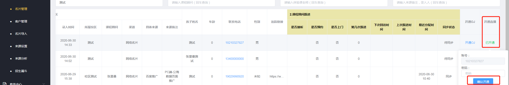
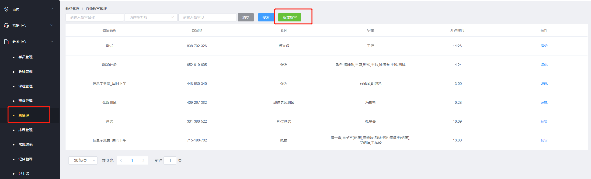
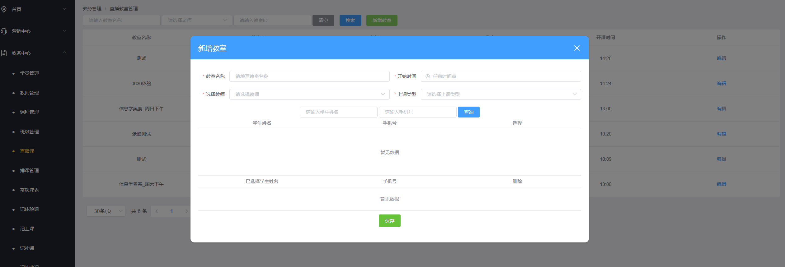

.. _header-n0:

码高教育直播教室使用说明
========================

.. _header-n3:

**账号信息**
------------

1：教师账号为天眼系统里面，角色为教师的员工账号信息，其他角色，登录不了。

2：学生账号为天眼中名片管理里面，开通直播的账号密码，开通账号是默认手机号作为账号密码。

.. _header-n6:

**教室信息**
------------

登陆成功后，可以看到教室信息

1：教师人员登陆后，可以看到自己开课班级信息。

2：学生登录后，可以看到自己所在的班级信息。

.. image:: image/image-20200701102734566.png

.. _header-n11:

**如何创建学生账号**
--------------------

天眼系统中名片管理，最后一列，有开通直播按钮，输入密码点击确定开通，状态变为已开通

.. _header-n14:

**如何排课**
------------

在教务中心新增直播课菜单，显示权限校区内的教室（教师人员只能看到自己的教室，校长及教学主管等管理人员可以看到权限内的所有教室）。

 

.. _header-n17:

新增教室
~~~~~~~~

点击新增教室，弹框显示页面，按照提示输入教室基本信息，选择教师，选择学员（报名、未报名都可以）。保存后，该老师登录直播教室以后可以看到新增的教室，学员登陆后可以看到该教室。

.. _header-n21:

**常见问题解答**
-----------------

1：怎么记课时？

答：正式学员使用【记补课】操作进行课时消耗，体验课学员使用【记体验课】。

2：谁可以看到这个直播课？

答：教师只能看到自己的，咨询或者校长可以看到校区内的。

3：出现问题，老师不会解决？

答：技术中心提供后续技术支持，如需帮助，可加QQ群：929110302   或者钉钉里提工单。

